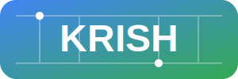
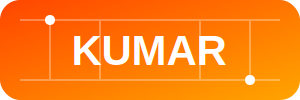

<div align="center">


<div align="center">
  
  
</div>

<!-- Fun Animated SVGs -->
<svg width="400" height="100" viewBox="0 0 400 100" xmlns="http://www.w3.org/2000/svg" style="margin: 20px auto;">
  <defs>
    <style>
      @keyframes bounce {
        0%, 100% { transform: translateY(0); }
        50% { transform: translateY(-20px); }
      }
      @keyframes spin {
        0% { transform: rotate(0deg); }
        100% { transform: rotate(360deg); }
      }
      @keyframes float {
        0%, 100% { transform: translateY(0px); }
        50% { transform: translateY(-15px); }
      }
      @keyframes wiggle {
        0%, 100% { transform: rotate(0deg); }
        25% { transform: rotate(-5deg); }
        75% { transform: rotate(5deg); }
      }
      @keyframes pulse {
        0%, 100% { opacity: 1; }
        50% { opacity: 0.5; }
      }
      
      .bounce-elem { animation: bounce 1.5s infinite; }
      .spin-elem { animation: spin 3s linear infinite; }
      .float-elem { animation: float 2.5s ease-in-out infinite; }
      .wiggle-elem { animation: wiggle 0.6s infinite; }
      .pulse-elem { animation: pulse 1.5s infinite; }
    </style>
  </defs>
  
  <!-- Bouncing Rocket -->
  <g class="bounce-elem" style="transform-origin: 50px 50px;">
    <text x="45" y="70" font-size="50" text-anchor="middle">🚀</text>
  </g>
  
  <!-- Spinning Star -->
  <g class="spin-elem" style="transform-origin: 150px 50px;">
    <text x="150" y="70" font-size="50" text-anchor="middle">⭐</text>
  </g>
  
  <!-- Floating Code -->
  <g class="float-elem" style="transform-origin: 250px 50px;">
    <text x="250" y="70" font-size="50" text-anchor="middle">💻</text>
  </g>
  
  <!-- Wiggling Lightning -->
  <g class="wiggle-elem" style="transform-origin: 350px 50px;">
    <text x="350" y="70" font-size="50" text-anchor="middle">⚡</text>
  </g>
</svg>

<!-- Fun Happy SVG Characters -->
<svg width="500" height="120" viewBox="0 0 500 120" xmlns="http://www.w3.org/2000/svg" style="margin: 20px auto;">
  <defs>
    <style>
      @keyframes happy-jump {
        0%, 100% { transform: translateY(0); }
        50% { transform: translateY(-25px); }
      }
      @keyframes dance {
        0%, 100% { transform: skewX(0deg) translateY(0); }
        25% { transform: skewX(-5deg) translateY(-10px); }
        75% { transform: skewX(5deg) translateY(-10px); }
      }
      @keyframes head-nod {
        0%, 100% { transform: rotateZ(0deg); }
        25% { transform: rotateZ(-15deg); }
        75% { transform: rotateZ(15deg); }
      }
      @keyframes blink {
        0%, 100% { opacity: 1; }
        50% { opacity: 0.3; }
      }
      
      .happy-jump { animation: happy-jump 1s infinite; }
      .dance { animation: dance 1.2s infinite; }
      .head-nod { animation: head-nod 1.5s infinite; }
      .blink { animation: blink 1.5s infinite; }
    </style>
  </defs>
  
  <!-- Happy Character 1 (dancing) -->
  <g class="dance" style="transform-origin: 70px 80px;">
    <!-- Body -->
    <circle cx="70" cy="70" r="20" fill="#FF1801" opacity="0.8"/>
    <!-- Head -->
    <circle cx="70" cy="35" r="18" fill="#FF6B6B"/>
    <!-- Eyes -->
    <circle cx="63" cy="30" r="3" fill="black" class="blink"/>
    <circle cx="77" cy="30" r="3" fill="black" class="blink"/>
    <!-- Happy Mouth -->
    <path d="M 63 38 Q 70 42 77 38" stroke="black" stroke-width="2" fill="none" stroke-linecap="round"/>
    <!-- Arms -->
    <line x1="50" y1="65" x2="30" y2="55" stroke="#FF1801" stroke-width="4" stroke-linecap="round"/>
    <line x1="90" y1="65" x2="110" y2="55" stroke="#FF1801" stroke-width="4" stroke-linecap="round"/>
    <!-- Legs -->
    <line x1="60" y1="88" x2="55" y2="105" stroke="#FF1801" stroke-width="4" stroke-linecap="round"/>
    <line x1="80" y1="88" x2="85" y2="105" stroke="#FF1801" stroke-width="4" stroke-linecap="round"/>
  </g>
  
  <!-- Happy Character 2 (jumping) -->
  <g class="happy-jump" style="transform-origin: 200px 80px;">
    <!-- Body -->
    <rect x="185" y="55" width="30" height="35" rx="5" fill="#191970" opacity="0.8"/>
    <!-- Head -->
    <circle cx="200" cy="35" r="18" fill="#0033CC"/>
    <!-- Eyes -->
    <circle cx="193" cy="30" r="3" fill="white"/>
    <circle cx="207" cy="30" r="3" fill="white"/>
    <!-- Happy wide smile -->
    <path d="M 190 38 Q 200 42 210 38" stroke="white" stroke-width="2" fill="none" stroke-linecap="round"/>
    <!-- Arms raised -->
    <line x1="185" y1="65" x2="160" y2="40" stroke="#191970" stroke-width="4" stroke-linecap="round"/>
    <line x1="215" y1="65" x2="240" y2="40" stroke="#191970" stroke-width="4" stroke-linecap="round"/>
    <!-- Legs -->
    <line x1="190" y1="90" x2="185" y2="110" stroke="#191970" stroke-width="4" stroke-linecap="round"/>
    <line x1="210" y1="90" x2="215" y2="110" stroke="#191970" stroke-width="4" stroke-linecap="round"/>
  </g>
  
  <!-- Happy Character 3 (nodding) -->
  <g style="transform-origin: 330px 60px;">
    <g class="head-nod">
      <!-- Head -->
      <circle cx="330" cy="35" r="18" fill="#FFB81C"/>
      <!-- Eyes -->
      <circle cx="323" cy="30" r="3" fill="black"/>
      <circle cx="337" cy="30" r="3" fill="black"/>
      <!-- Smile -->
      <path d="M 320 38 Q 330 42 340 38" stroke="black" stroke-width="2" fill="none" stroke-linecap="round"/>
    </g>
    <!-- Body -->
    <circle cx="330" cy="70" r="20" fill="#FFD700" opacity="0.8"/>
    <!-- Arms -->
    <line x1="310" y1="65" x2="285" y2="55" stroke="#FFB81C" stroke-width="4" stroke-linecap="round"/>
    <line x1="350" y1="65" x2="375" y2="55" stroke="#FFB81C" stroke-width="4" stroke-linecap="round"/>
    <!-- Legs -->
    <line x1="320" y1="88" x2="315" y2="110" stroke="#FFB81C" stroke-width="4" stroke-linecap="round"/>
    <line x1="340" y1="88" x2="345" y2="110" stroke="#FFB81C" stroke-width="4" stroke-linecap="round"/>
  </g>
  
  <!-- Happy Character 4 (thumbs up) -->
  <g class="pulse-elem" style="transform-origin: 450px 80px;">
    <!-- Body -->
    <circle cx="450" cy="70" r="20" fill="#46E3B7" opacity="0.8"/>
    <!-- Head -->
    <circle cx="450" cy="35" r="18" fill="#2DD4BF"/>
    <!-- Eyes (happy) -->
    <circle cx="443" cy="28" r="3" fill="black"/>
    <circle cx="457" cy="28" r="3" fill="black"/>
    <!-- Big smile -->
    <path d="M 440 38 Q 450 44 460 38" stroke="black" stroke-width="2" fill="none" stroke-linecap="round"/>
    <!-- Thumbs up -->
    <g>
      <line x1="440" y1="50" x2="440" y2="20" stroke="#46E3B7" stroke-width="6" stroke-linecap="round"/>
      <circle cx="440" cy="18" r="7" fill="#46E3B7"/>
    </g>
  </g>
</svg>

<!-- Funny Computer Guy SVG -->
<svg width="300" height="100" viewBox="0 0 300 100" xmlns="http://www.w3.org/2000/svg" style="margin: 20px auto;">
  <defs>
    <style>
      @keyframes typing {
        0%, 100% { width: 30px; }
        50% { width: 50px; }
      }
      @keyframes eyes-focus {
        0%, 100% { transform: scale(1); }
        50% { transform: scale(1.2); }
      }
      
      .keyboard-active { animation: typing 0.8s infinite; }
      .eyes-focus { animation: eyes-focus 1.5s infinite; }
    </style>
  </defs>
  
  <!-- Monitor Frame -->
  <rect x="40" y="20" width="100" height="70" rx="5" fill="none" stroke="#191970" stroke-width="3"/>
  <!-- Screen glow -->
  <rect x="45" y="25" width="90" height="60" rx="3" fill="#1a1a2e" opacity="0.9"/>
  
  <!-- Code on screen (animated) -->
  <text x="50" y="40" font-size="8" fill="#00FF00" font-family="monospace">
    <tspan>code</tspan>
    <tspan x="50" dy="8">++;</tspan>
    <tspan x="50" dy="8">while(true)</tspan>
  </text>
  
  <!-- Cursor blinking -->
  <rect x="50" y="70" width="2" height="6" fill="#00FF00" opacity="0.7">
    <animate attributeName="opacity" values="1;0;1" dur="1s" repeatCount="indefinite"/>
  </rect>
  
  <!-- Monitor stand -->
  <rect x="70" y="88" width="40" height="8" rx="2" fill="#191970"/>
  
  <!-- Programmer Head -->
  <circle cx="200" cy="35" r="15" fill="#FFB700"/>
  <!-- Eyes focused on screen -->
  <g class="eyes-focus">
    <circle cx="193" cy="30" r="3" fill="black"/>
    <circle cx="207" cy="30" r="3" fill="black"/>
  </g>
  <!-- Thinking expression -->
  <path d="M 195 38 Q 200 40 205 38" stroke="black" stroke-width="1.5" fill="none" stroke-linecap="round"/>
  
  <!-- Coffee Cup (emergency fuel) -->
  <g style="opacity: 0.9;">
    <rect x="220" y="50" width="20" height="25" rx="2" fill="#8B4513" stroke="#654321" stroke-width="1"/>
    <path d="M 240 55 Q 250 55 250 65 Q 250 70 240 70" fill="none" stroke="#8B4513" stroke-width="2"/>
    <!-- Steam wisps -->
    <path d="M 225 48 Q 225 35 220 30" stroke="#D3D3D3" stroke-width="1.5" fill="none" stroke-linecap="round" opacity="0.6">
      <animate attributeName="d" values="M 225 48 Q 225 35 220 30; M 225 48 Q 227 35 222 30; M 225 48 Q 225 35 220 30" dur="2s" repeatCount="indefinite"/>
    </path>
  </g>
  
  <!-- Keyboard typing animation -->
  <g style="opacity: 0.7;">
    <rect x="150" y="65" width="30" height="20" rx="2" fill="#333" stroke="#666" stroke-width="1"/>
    <line x1="155" y1="68" x2="155" y2="82" stroke="#666" stroke-width="0.5"/>
    <line x1="162" y1="68" x2="162" y2="82" stroke="#666" stroke-width="0.5"/>
    <line x1="169" y1="68" x2="169" y2="82" stroke="#666" stroke-width="0.5"/>
    <line x1="176" y1="68" x2="176" y2="82" stroke="#666" stroke-width="0.5"/>
    <circle cx="158" cy="75" r="1.5" fill="#FFB700" class="keyboard-active"/>
  </g>
</svg>

</div>

</div>

---

### 👋 About Me

Computer Science undergraduate focused on building scalable, real-world software systems through hands-on development, competitive hackathons, and continuous learning.

| Category | Details |
|--------|--------|
| **Name** | Krish Kumar |
| **Education** | B.Tech in Computer Science, SRM University 3rd year CGPA 9.76/10 |
| **Experience** | Samsung R&D Intern (Virtual) |
| **Programs** | Apple iOS Student Developer Program |
| **Current Work** | Developing an iOS application at the iOS Development Centre powered by Infosys & Apple |
| **Technical Involvement** | Member, IEEE Computer Society |
| **Awards & Achievements** | Winner, Red Bull Basement International Hackathon (2024)<br>Academic Excellence Award, SRM University (2024–2025)<br>Participant, Smart India Hackathon (2024, 2025) |
| **Soft Skills** | Leadership (team management, delegation, motivation)<br>Communication (technical writing, presentations)<br>Problem-solving (analytical thinking, root-cause analysis)<br>Adaptability (rapid learning, working with ambiguity)<br>Collaboration (cross-functional teamwork, active listening) |

<div align="center">


[](https://portfolio2-three-lime.vercel.app/)
[](https://www.linkedin.com/in/krish-kumar-1a119728a/)

</div>

---
---

<div align="center">
  <p>━━━━━━━━━━━━━━━━━━━━━━━━━━━━━━━━━━</p>
</div>

## 📌 **PROJECTS**

| Project | Description | Year |
|------|------------|------|
| **LLM-Based Query Optimization System** | Used large language models to restructure and optimize SQL queries. Achieved **65% faster execution time** using local database optimisations. | **2025–Present** |
| **Movify –  Recommendation Platform** | Built a movie recommender using collaborative filtering and content-based analysis. | **2024** |
| **Smart Supply Chain Manager (Frontend)** | Developed a Flutter application for real-time inventory tracking  | **2025** |
| **VibeOut – Emotion-Based Fitness Companion** | Built an AI-powered app recommending workouts based on real-time emotion detection with secure authentication and privacy-focused design. | **2024** |
| **OnePass – School Database Management System** | Developed a full-stack application for managing student records, academics, and administrative data for schools. | **2024** |
| **Task Prioritizer – Web Productivity App** | Built a web-based task prioritization and to-do list application to organize tasks efficiently and improve productivity. | **2024** |

<div align="center">
  <p>━━━━━━━━━━━━━━━━━━━━━━━━━━━━━━━━━━</p>
</div>

---


## ⚡ **POWER-UPS & ABILITIES**

<div align="center">

```
╔═══════════════════════════════════════════════════════════════╗
║  🏎️ CURRENT QUESTS:                                          ║
║  ├─ 🌐 Web & Mobile Apps (React, Flask, Android Studio)      ║
║  ├─ 🧠 Learning Blockchain & AI Integration                   ║
║  ├─ 🚀 Planning My Own Tech Startup                          ║
║  └─ 🏆 Collecting More Hackathon Victories                   ║
╚═══════════════════════════════════════════════════════════════╝
```

</div>

### 🛠️ **WEAPONS OF CHOICE**

<div align="center">

**PROGRAMMING LANGUAGES**
<br>


<!-- F1 car emoji -->
<p style="font-size: 50px;">🏎️</p>

**FRAMEWORKS & LIBRARIES**
<br>


<!-- Iron Man emoji -->
<p style="font-size: 50px;">🦸‍♂️</p>

**CLOUD & DEPLOYMENT**
<br>


**DATABASES & AI/ML**
<br>


**DESIGN & TOOLS**
<br>


</div>


</div>


**Stay tuned for:**
- 🌐 Full-Stack Web Applications
- 📱 Mobile Apps with React Native
- 🤖 AI/ML Integration Projects
- 🔗 Blockchain Experiments
- 🎮 Fun Side Projects

</div>

---

<div align="center">
  <!-- Racing theme divider -->
  <p>🏁 🔴 ⚫ 🔴 ⚫ 🔴 ⚫ 🔴 ⚫ 🔴 ⚫ 🔴 ⚫ 🔴 ⚫ 🔴 ⚫ 🏁</p>
</div>

## 🤝 **JOIN THE SQUAD**

<div align="center">

**Want to collaborate on something awesome?**

```
┌─ 🦸‍♂️ ASSEMBLING THE AVENGERS ─┐
│                               │
│  Looking for:                 │
│  ├─ Frontend Wizards          │
│  ├─ Backend Ninjas            │
│  ├─ UI/UX Artists             │
│  ├─ DevOps Gurus              │
│  └─ Fellow Innovators         │
│                               │
└─ Let's build the future! ─────┘
```

### 🌐 **CONNECT WITH ME**

<!-- Social media badges with F1 team colors -->
[](https://instagram.com/__krish___2005)
</div>

---


### 💭 **DAILY INSPIRATION**

<!-- Quote display with F1 team colors -->


---

**Thanks for visiting! Now go forth and code something amazing!** 🚀

<p style="font-size: 20px;">🏁 🏎️ 🦸‍♂️ 💻 ⚡</p>

</div>

---

<details>
<summary>🎮 <b>EASTER EGG</b> - Click to reveal!</summary>

```javascript
// Secret message for fellow developers
console.log("🎉 You found the easter egg!");
console.log("Here's a secret: I debug with console.log() and I'm not ashamed!");
console.log("Want to collaborate? Let's build something epic together! 🚀");

// F1 x Marvel Easter Egg
console.log("If Tony Stark drove in F1, he'd definitely beat Lewis Hamilton.");

// Konami Code: ↑↑↓↓←→←→BA
document.addEventListener('keydown', function(e) {
    // Implementation of awesome surprise coming soon! 😉
});
```

**Fun Fact:** This README was written while listening to epic coding playlists and consuming an unhealthy amount of energy drinks! 🎵⚡

<div align="center">
  <p style="font-size: 30px;">🦸‍♂️ 🏎️ ⚡ 🛠️ 💻 🚀</p>
</div>

</details>
